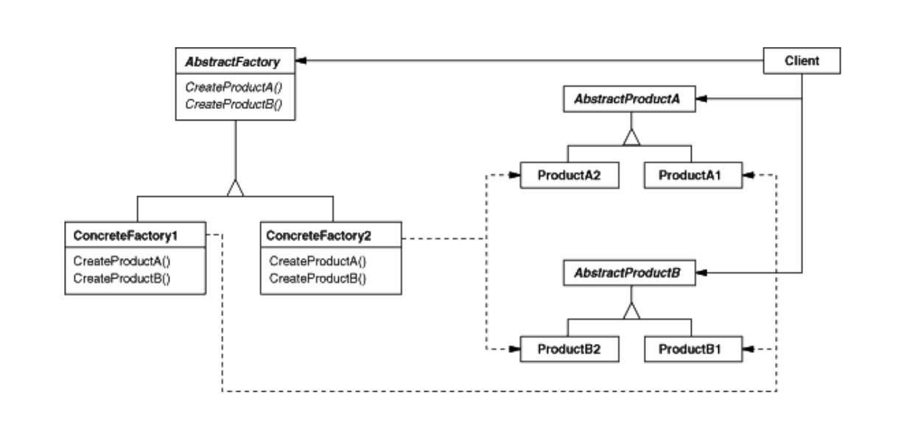
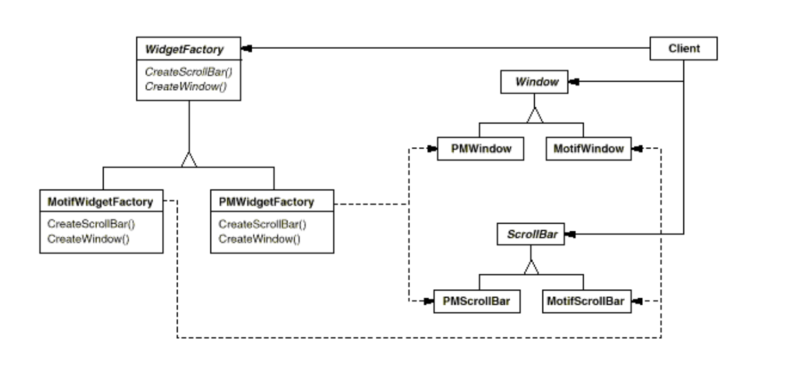
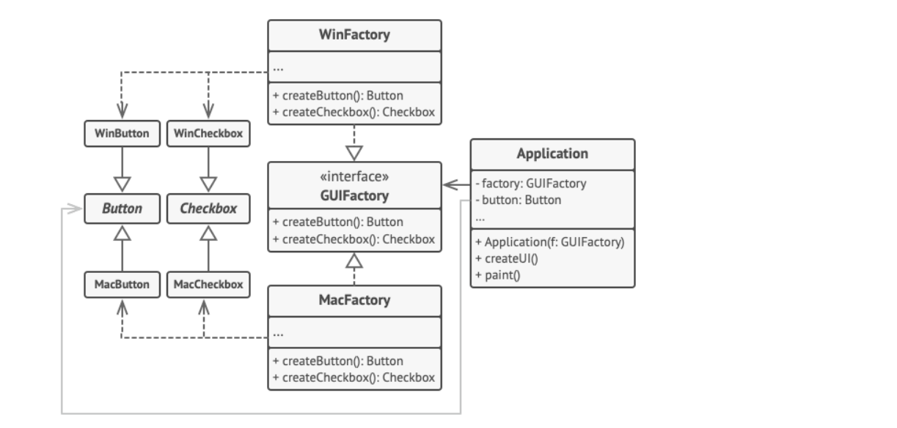

# Abstract Factory (***creational*** )

## Problem:
You have an object that works with a set of objects that related to a family. so you have 2 options:

- create all elements of the set in client code separately
- delegate this responsibility to a abstract factory class


## Solution
Create an abstract factory interface and any necessary implementation of it to create all elements of each set at once.

## Diagram

general diagram

gof example

guru example

#

## Sudo code
```
interface GUIFactory is
    method createButton():Button
    method createCheckbox():Checkbox

class WinFactory implements GUIFactory is
    method createButton():Button is
        return new WinButton()
    method createCheckbox():Checkbox is
        return new WinCheckbox()

class MacFactory implements GUIFactory is
    method createButton():Button is
        return new MacButton()
    method createCheckbox():Checkbox is
        return new MacCheckbox()

interface Button is
    method render()

class WinButton implements Button is
    method render() is
        // Render a button in Windows style.

class MacButton implements Button is
    method render() is
        // Render a button in macOS style.

interface Checkbox is
    method render()

class WinCheckbox implements Checkbox is
    method render() is
        // Render a checkbox in Windows style.

class MacCheckbox implements Checkbox is
    method render() is
        // Render a checkbox in macOS style.

// The client code works with factories and products only
class Application is
    private field factory: GUIFactory
    private field button: Button
    constructor Application(factory: GUIFactory) is
        this.factory = factory
    method createUI() is
        this.button = factory.createButton()
    method render() is
        button.render()

class ApplicationConfigurator is
    method main() is
        config = readApplicationConfigFile()

        if (config.OS == "Windows") then
            factory = new WinFactory()
        else if (config.OS == "Mac") then
            factory = new MacFactory()
        else
            throw new Exception("Error! Unknown operating system.")

        Application app = new Application(factory)
```