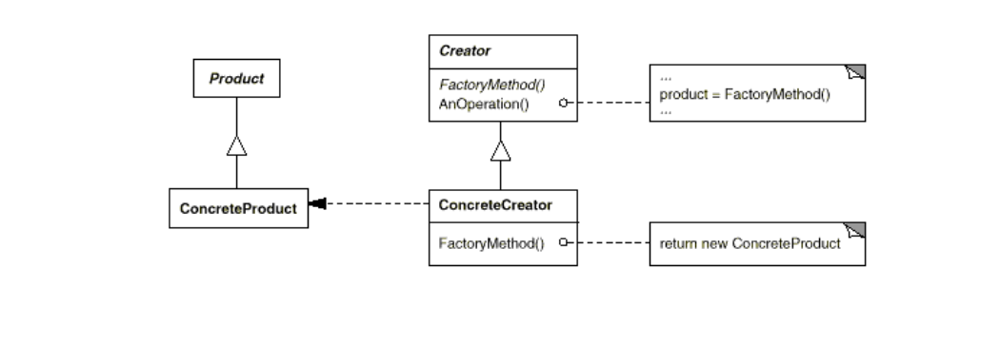
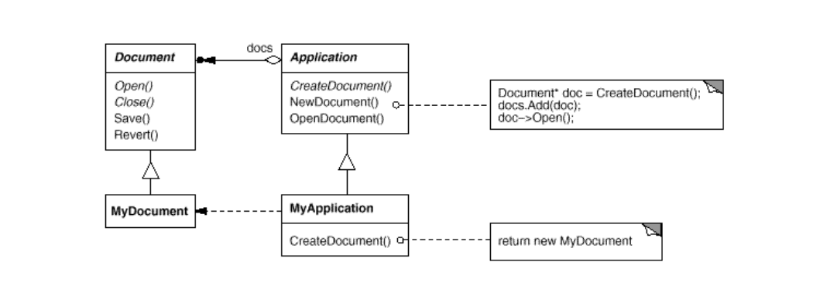
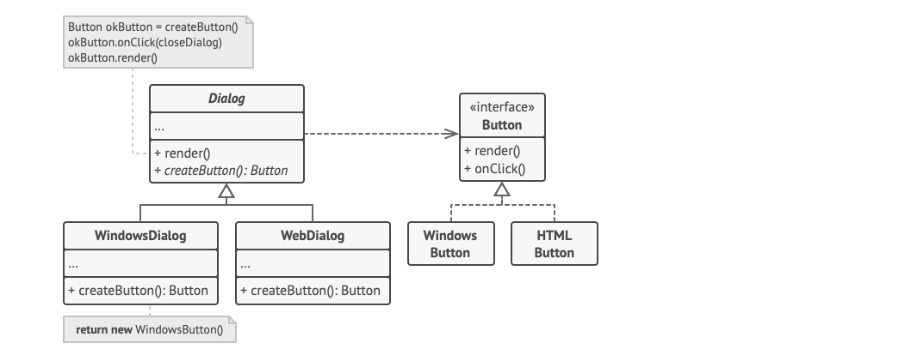

# Factory method (***creational*** )

## Problem:
You have two abstract classes from two library that work together. But as they are abstract no one knows which instance of each one should create to work properly.
GOF example is about an **Application** that works with an **Document**.


## Solution
Delegate **Product**(Document) instantiation to **Creator**(Application) subclasses (that's it).

## Diagram

general diagram

gof example

guru example

#

## Sudo code
```
class Creator is
    abstract method factory():Product

    method run()
        Product product = this.factory()
        product.do()

class CreatorA extends Creator is
    method factory():ProductA is
        return new ProductA()

class CreatorB extends Creator is
    method factory():ProductB is
        return new ProductB()

interface Product is
    method do()

class ProductA implements Product is
    method do() is
        // do what ever product type A must do

class ProductB implements Product is
    method do() is
       // do what ever product type B must do

class Application is
    Creator creator

    method initialize() is
        config = readApplicationConfigFile()

        if (config.state == "A") then
            this.creator = new CreatorA()
        else if (config.state == "B") then
            this.creator = new CreatorB()
        else
            throw new Exception("Unknown state.")

    method main() is
        this.initialize()
        this.creator.run()
```